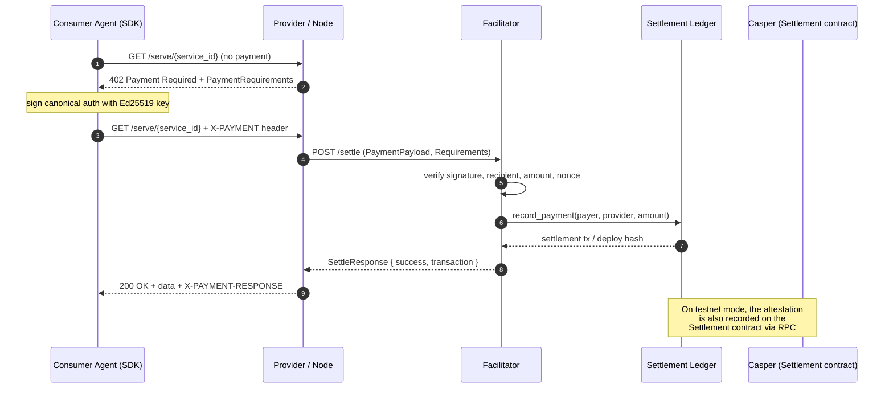
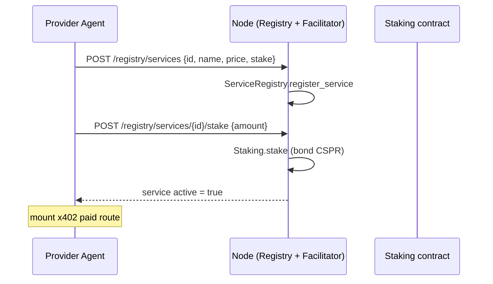

# Architecture

A deep dive into how PayMesh's layers fit together — from on-chain contracts to
the x402 payment rail to the agent SDKs and the operational dashboard.

## System Overview

PayMesh is a four-layer stack. Each layer has a single, well-defined job, and the
interfaces between them are small and typed. The result is that the *same agent
code* runs against an offline in-process simulation or the live Casper testnet —
only the backend configuration changes.

```
┌──────────┐   x402 payment    ┌──────────────┐   on-chain settle   ┌─────────────────┐
│  Consumer │ ───────────────→ │  Facilitator  │ ─────────────────→ │  Casper Testnet  │
│   Agent   │ ← 200 OK + data  │  (FastAPI)    │ ←  receipt         │  4 Odra contracts│
└──────────┘                   └──────────────┘                     └─────────────────┘
                                        ↕                                    ↕
                                ┌──────────────┐                     ┌─────────────────┐
                                │   Provider   │ ← service call      │  PayMesh Python  │
                                │    Agent     │ ──────────────→     │       SDK        │
                                └──────────────┘                     └─────────────────┘
```

### The four layers

```
┌──────────────────────────────────────────────────────────────────────────┐
│  DASHBOARD LAYER        React + Vite + Recharts + React Router            │
│  / Marketplace · /observe · /demo      (talks to the node over REST)      │
├──────────────────────────────────────────────────────────────────────────┤
│  SDK LAYER             PayMeshClient (Python + TypeScript)                │
│  typed: register · stake · call · rate · deposit · discover               │
├──────────────────────────────────────────────────────────────────────────┤
│  x402 PAYMENT LAYER    Facilitator · x402 Client · Provider middleware    │
│  verify → settle → on-chain attestation · escrow ledger · replay defense  │
├──────────────────────────────────────────────────────────────────────────┤
│  SMART CONTRACT LAYER  ServiceRegistry · Staking · Settlement · Reputation│
│  Odra (Rust) → WASM → Casper testnet                                      │
└──────────────────────────────────────────────────────────────────────────┘
```

## Component Breakdown

### 1. Smart Contracts Layer (`src/`)

Four independently deployable Odra contracts form the on-chain backbone:

| Contract | Role | Key state |
|----------|------|-----------|
| **ServiceRegistry** | Discovery — agents register/list services | `service_id → ServiceInfo` |
| **Staking** | Providers lock CSPR collateral; slashing | `service_id → StakeInfo` |
| **Settlement** | Verified x402 payments recorded on-chain | append-only `PaymentRecord` list |
| **Reputation** | Consumers rate 1–5; aggregate score kept | `service_id → RatingAggregate` |

All four are written in Rust using the [Odra framework](https://odra.dev) v2.8.2,
compiled to WASM, and deployed to Casper testnet. See
[smart-contracts.md](smart-contracts.md) for the full method reference.

### 2. x402 Payment Layer (`x402/`)

The trust-minimizing middle of every payment:

- **`facilitator.py`** — a FastAPI service that *verifies* a payment signature
  against the requested `PaymentRequirements`, then *settles* it by recording the
  attestation on the Settlement ledger. Endpoints: `/verify`, `/settle`,
  `/balances/{account}`, `/recent_payments`.
- **`client.py`** (`x402_fetch`) — wraps `requests` so any `402 Payment Required`
  is handled automatically: read requirements → sign payload → retry with the
  `X-PAYMENT` header → return the resource + settlement receipt.
- **`provider.py`** — middleware that charges per call. Responds `402` when no
  payment is attached; settles via the facilitator and returns `200` when one is.
- **`crypto.py`** — Casper Ed25519 key handling + the canonical authorization
  string that gets signed.
- **`ledger.py`** — the settlement ledger with two interchangeable backends
  (`LocalLedger` for offline, `OnChainLedger` for live testnet).
- **`node.py`** — composes the facilitator with the marketplace REST API over a
  shared in-process backend, so provider and consumer agents see the same state.

### 3. SDK Layer (`sdk/python/`, `sdk/js/`)

Typed entry points that hide payment complexity from agents:

- **`PayMeshClient`** — one object for the whole lifecycle: `register_service`,
  `stake`, `discover_services`, `call_service`, `rate_service`, `deposit`,
  `balance`, `revenue`.
- **Backends** — `LocalContractBackend` (in-process simulation) and
  `CasperContractBackend` / `HttpContractBackend` (live) share an identical
  abstract interface. Swapping demo↔testnet is a one-line config change.
- **`models.py`** — dataclasses mirroring the on-chain structs (`ServiceInfo`,
  `StakeInfo`, `ReputationAggregate`, `Review`, `CallResult`).

### 4. Dashboard Layer (`dashboard/`)

A React SPA with three routes, all served from one Vite dev server that proxies
API calls to the node:

- **`/`** — Marketplace overview (stats, service cards, live tx feed).
- **`/observe`** — Observability dashboard (KPIs, volume chart, revenue bars,
  reputation donut, contract status, agent registry, network status).
- **`/demo`** — Interactive demo console (one-click agent lifecycle buttons).

## Data Flow: a single payment

A consumer agent paying for one service call moves through **all four layers**:



1. The **consumer** calls the service endpoint with no payment.
2. The **provider** responds `402` with `PaymentRequirements` (amount, recipient,
   scheme, network).
3. The consumer builds a `PaymentPayload`, signs the canonical authorization
   string, and retries with the `X-PAYMENT` header.
4. The **facilitator** verifies the signature, checks the recipient/amount match,
   and consumes the nonce (single-use, replay-protected).
5. The **ledger** records the payment (locally, and — in testnet mode — as an
   on-chain `record_payment` attestation on the Settlement contract).
6. The provider returns `200` with the resource and a settlement receipt.

The SDK wraps steps 1–3 so the agent just calls `pm.call_service("risk-api")`.

## Sequence: full provider lifecycle



## Design Decisions & Trade-offs

**Why HTTP-native payments (x402) over payment channels?**
x402 reuses the protocol every API already speaks. Agents don't open channels,
fund them, or manage HTLCs — they send an HTTP request and, if needed, a signed
payment header. The facilitator attests settlement. This keeps agent logic tiny.

**Why a facilitator instead of pure peer-to-peer settlement?**
The facilitator performs the cryptographic verification *off-chain* (fast, cheap)
and records only the *attestation* on-chain. This keeps per-call gas out of the
hot path while preserving an immutable, queryable on-chain record.

**Why an in-process `LocalLedger` that mirrors the on-chain contract?**
The on-chain `Settlement` contract's `record_payment` ABI is mirrored exactly by
`LocalLedger`, which produces the same `PaymentRecord` shape. The demo therefore
runs fully offline and reliably (no testnet flakiness for judges) while using the
*same data* the chain produces. Switching to live testnet is a backend swap.

**Why denormalised reputation snapshots in the registry?**
`ServiceRegistry.ServiceInfo` caches `reputation_score` and `total_ratings` so a
dashboard renders a service in a single read, without a cross-contract call per
query. Authorised relayers push fresh snapshots via `update_reputation_snapshot`.

**Why Ed25519 for x402 signatures (and secp256k1 for the deployer)?**
Casper supports both key algorithms. x402 payment signing uses Ed25519 (single
key pair, fast verification, matches `@noble/ed25519` in the JS SDK). Contract
deploys use the secp256k1 deployer key in `keys/`. The `casper-exact` scheme ties
the two: the `from`/`to` accounts are the Ed25519 payment identities.

**Why a 24-hour withdrawal cooldown on stakes?**
`Staking.DEFAULT_COOLDOWN_SECS` (86,400s) gives governance a window to detect and
slash misbehaviour *before* a provider can drain their collateral and exit.

---

Next: [Smart Contracts](smart-contracts.md) · [API Reference](api-reference.md)
