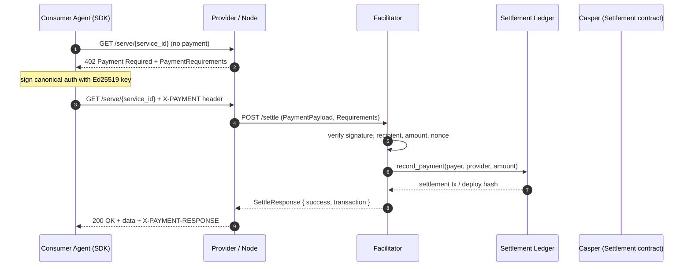
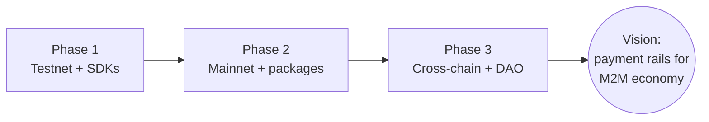

# PayMesh Diagrams

Source diagrams for PayMesh docs. Mermaid blocks render natively on GitHub; the
ASCII diagrams are embedded directly in the relevant documents.

---

## 1. High-level architecture (ASCII)

Also at the top of [README.md](../README.md).

```
┌──────────┐   x402 payment    ┌──────────────┐   on-chain settle   ┌─────────────────┐
│  Consumer │ ───────────────→ │  Facilitator  │ ─────────────────→ │  Casper Testnet  │
│   Agent   │ ← 200 OK + data  │  (FastAPI)    │ ←  receipt         │  4 Odra contracts│
└──────────┘                   └──────────────┘                     └─────────────────┘
                                        ↕                                    ↕
                                ┌──────────────┐                     ┌─────────────────┐
                                │   Provider   │ ← service call      │  PayMesh Python  │
                                │    Agent     │ ──────────────→     │       SDK        │
                                └──────────────┘                     └─────────────────┘
```

## 2. Four-layer stack (ASCII)

```
┌──────────────────────────────────────────────────────────────────────────┐
│  DASHBOARD        React + Vite + Recharts + React Router                  │
│  / · /observe · /demo                                                    │
├──────────────────────────────────────────────────────────────────────────┤
│  SDK              PayMeshClient (Python + TypeScript)                     │
│  register · stake · call · rate · deposit · discover                     │
├──────────────────────────────────────────────────────────────────────────┤
│  x402 PAYMENT     Facilitator · x402 Client · Provider middleware         │
│  verify → settle → on-chain attestation · escrow ledger · replay defense  │
├──────────────────────────────────────────────────────────────────────────┤
│  SMART CONTRACTS  ServiceRegistry · Staking · Settlement · Reputation     │
│  Odra (Rust) → WASM → Casper testnet                                     │
└──────────────────────────────────────────────────────────────────────────┘
```

## 3. Payment data flow (Mermaid)

Used in [architecture.md](../architecture.md).



## 4. Roadmap progression (Mermaid)

Used in [roadmap.md](../roadmap.md).


