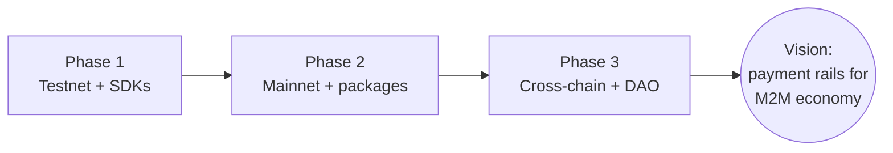

# Roadmap

Where PayMesh is, and where it's going — from a live testnet to the payment rails
of the machine-to-machine economy.

> **Vision:** _PayMesh is the payment rails for the machine-to-machine economy._
> Every agent that sells or buys a service should be able to plug in, discover,
> price, pay, and settle — in one HTTP request — without intermediaries.

---

## Status at a glance

| Capability | Status |
|------------|--------|
| 4 Odra contracts deployed to Casper Testnet | ✅ Live |
| x402 facilitator (verify + settle) | ✅ Live |
| Python SDK (typed, async-ready) | ✅ Live |
| TypeScript SDK (Node + browser) | ✅ Live |
| Marketplace dashboard (`/`) | ✅ Live |
| Observability dashboard (`/observe`) | ✅ Live |
| Interactive demo console (`/demo`) | ✅ Live |
| On-chain slashing governance | 🔧 Owner-only (centralized) |
| Mainnet deployment | 🚧 Planned |
| Published `pip` / `npm` packages | 🚧 Planned |
| Cross-chain support | 🔭 Research |

---

## Phase 1 — Testnet foundation ✅ *(current)*

The marketplace is live and end-to-end functional on Casper testnet.

- **4 Odra contracts** (ServiceRegistry, Staking, Settlement, Reputation) deployed
  and verified — see [smart-contracts.md](smart-contracts.md).
- **x402 payment layer** with signature verification, single-use nonces, and a
  settlement ledger that mirrors the on-chain `record_payment` ABI.
- **Dual SDKs** (Python + TypeScript) with an identical typed surface — agents
  write one code path and swap local ↔ HTTP ↔ testnet backends.
- **Three dashboard surfaces**: marketplace overview, observability analytics
  (real KPIs, volume chart, revenue bars, reputation donut, contract status,
  agent registry), and an interactive one-click demo console.
- **Cloudflare Tunnel hosting** for public demos.

> _What we proved: agents can discover, pay per-call over HTTP, and settle on
> Casper — with no intermediaries and full on-chain transparency._

## Phase 2 — Mainnet & stabilization 🚧

Make PayMesh production-grade and easy to adopt.

- **Mainnet deployment** of all four contracts, with audited WASM and a hardened
  recorder-key flow for `Settlement.record_payment`.
- **`pip install paymesh`** and **`npm install @paymesh/sdk`** published to the
  public registries (currently installed from the local path).
- **SDK stabilization**: versioned API, expanded error taxonomy, retries/timeouts,
  and connection-pooling for high-throughput agents.
- **Provider SDK tooling**: a `paymesh serve` CLI to mount a paid route from a
  config file, so any existing API becomes a metered PayMesh service in minutes.
- **Recorder decentralization**: multiple facilitators sharing recorder authority,
  with on-chain slashing for false attestations.

> _Goal: the first agent-to-agent payment settled on Casper mainnet._

## Phase 3 — Cross-chain & autonomy 🔭

Expand beyond a single chain and make the marketplace self-governing.

- **Cross-chain settlement**: settle x402 payments on additional EVM /
  non-EVM chains, with a unified settlement view. The ledger abstraction
  (`LocalLedger` ↔ `OnChainLedger`) already anticipates multiple `OnChainLedger`
  implementations.
- **Agent discovery protocol**: a standardized, gossip-based registry so an agent
  can find services across PayMesh nodes without a central directory — a true
  peer discovery layer on top of the on-chain registry.
- **DAO governance for slashing**: replace the owner-only slash authority in the
  Staking contract with an on-chain DAO (propose → vote → execute), so
  misbehaviour penalties are community-enforced and auditable.
- **Reputation portability**: reputation scores that follow a provider across
  chains and nodes, weighted by stake and history.

> _Goal: a multi-chain, self-governing marketplace where any agent can join,
> price, and be paid — trustlessly._

---

## Vision

AI agents are becoming autonomous economic actors — they buy data, sell
inference, rent compute, and compose services from each other. Today that economy
runs on credit cards, API keys, and invoices: slow, human-gated, and hostile to
machines.

**PayMesh makes the machine-to-machine economy native.** x402 turns every paid
interaction into one HTTP request; Casper turns every payment into a transparent,
queryable, on-chain record. No intermediaries, no accounts, no invoices — just
agents paying agents, settled at the speed of the network.

---

_Note: this roadmap is directional, not a commitment. Progress is tracked in the
repo's [CHANGELOG](../CHANGELOG.md)._
