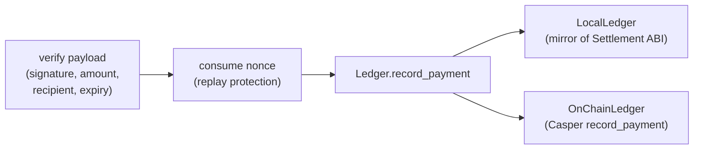

# x402 Payments

The payment rail that powers every transaction in PayMesh. This document explains
what x402 is, why PayMesh adopted it, and exactly how a payment is signed,
verified, and settled on Casper.

---

## What is x402?

[x402](https://x402.org) is an **HTTP-native payment protocol**. HTTP status
[402](https://developer.mozilla.org/en-US/docs/Web/HTTP/Status/402) — *Payment
Required* — has been reserved since 1991 but was never wired up. x402 finally
uses it: a server can charge for a resource by responding `402` with machine-
readable `PaymentRequirements`, and a client can pay and retry in the same flow.

**Why PayMesh uses it:**

- **Zero new infrastructure for agents.** Agents already speak HTTP. They don't
  open payment channels, manage UTXOs, or run a lightning node — they send a
  request and, if asked, attach a signed payment header.
- **Self-describing.** The `402` body carries everything a client needs to pay:
  amount, recipient, scheme, network, expiry.
- **Composable with the chain.** PayMesh's `casper-exact` scheme ties the signed
  payment to Casper Ed25519 accounts and settles the attestation on-chain.

```
 GET /serve/risk-score-api          →   402 Payment Required + PaymentRequirements
 GET /serve/risk-score-api          →   200 OK + resource + X-PAYMENT-RESPONSE
     (+ X-PAYMENT: <signed payload>)
```

---

## The 402 → pay → 200 flow, step by step

```mermaid
sequenceDiagram
    autonumber
    participant C as Consumer (x402_fetch)
    participant R as Resource / Provider
    participant F as Facilitator
    participant L as Settlement Ledger

    C->>R: GET /serve/{id}  (no payment)
    R-->>C: 402 + PaymentRequiredError { accepts: [Requirements] }
    Note over C: pick Requirements[0];<br/>build PaymentPayload;<br/>sign canonical auth
    C->>R: GET /serve/{id}  + X-PAYMENT: base64(payload)
    R->>F: POST /settle  (payload, requirements)
    F->>F: verify sig · recipient · amount · nonce · expiry
    F->>L: record_payment(payer, provider, amount, proof)
    L-->>F: transaction / deploy hash
    F-->>R: SettleResponse { success, transaction }
    R-->>C: 200 + body + X-PAYMENT-RESPONSE: base64(receipt)
    C->>C: decode PaidResponse { data, settlement }
```

1. **Request without payment.** `x402_fetch` issues the HTTP request normally.
   If the response is `200` (a free resource), it returns immediately.
2. **Parse the challenge.** On `402`, the body is a `PaymentRequiredError`
   carrying an `accepts` list of `PaymentRequirements` (amount, recipient, scheme,
   network, resource, expiry).
3. **Build & sign the payload.** The consumer constructs a `PaymentPayload` whose
   inner `authorization` is a canonical string of the payment fields, then signs
   that string with its Ed25519 private key.
4. **Retry with payment.** The request is re-sent with the `X-PAYMENT` header set
   to the base64-encoded payload.
5. **Verify & settle.** The provider forwards the payload to the facilitator's
   `/settle`. The facilitator re-derives the canonical authorization, checks the
   signature, confirms amount/recipient match, and consumes the single-use nonce.
6. **Record.** The ledger records the payment (locally and, in testnet mode, as
   an on-chain `record_payment` attestation).
7. **Serve.** The provider returns `200` with the resource and a settlement
   receipt in `X-PAYMENT-RESPONSE`.

---

## Payment signing (Casper Ed25519)

PayMesh uses the **`casper-exact`** scheme. A Casper Ed25519 account public key
is the single byte `0x01` followed by the 32-byte raw Ed25519 public key,
hex-encoded (66 hex chars).

**The canonical authorization string** (exactly what gets signed):

```text
{sender}\n{recipient}\n{value}\n{service_id}\n{nonce}
```

```python
from x402.crypto import canonical_authorization, sign_message, generate_account

account = generate_account("alice")
auth = canonical_authorization(
    sender   = account.public_account_hex,   # 01…
    recipient = "01d4e5f6…",
    value    = "50000000",                    # motes, as a string
    service_id = "risk-score-api",
    nonce    = "9f2c1a8b7e…",                 # 16 random bytes, hex
)
signature = sign_message(auth, account.private_key_hex)   # Ed25519 → hex
```

The facilitator re-derives the same string from the payload fields and checks it
**matches the payload's `authorization` field** (tamper protection) **before**
verifying the signature against the sender's public key.

> **Two key algorithms, one system.** x402 payment signing uses Ed25519 (matches
> `@noble/ed25519` in the JS SDK). Contract deploys use the secp256k1 deployer
> key. The `from`/`to` payment accounts are the Ed25519 identities.

---

## Wire types

### `PaymentRequirements`

```json
{
  "scheme": "casper-exact",
  "network": "casper-testnet",
  "asset": "CSPR",
  "maxAmountRequired": "50000000",
  "resource": "http://127.0.0.1:8002/risk",
  "description": "Risk Score API",
  "pay_to": "01d4e5f6…",
  "mimeType": "application/json",
  "created": 1751788800,
  "expires": 0
}
```

### `PaymentPayload`

```json
{
  "x402_version": 1,
  "scheme": "casper-exact",
  "network": "casper-testnet",
  "payload": {
    "from": "01a1b2c3…",
    "to": "01d4e5f6…",
    "value": "50000000",
    "service_id": "risk-score-api",
    "nonce": "9f2c1a8b7e…",
    "authorization": "01a1b2c3…\n01d4e5f6…\n50000000\nrisk-score-api\n9f2c1a8b7e…"
  },
  "signature": "8e3b…"
}
```

### `SettleResponse`

```json
{
  "success": true,
  "network": "casper-testnet",
  "transaction": "tx-000123",
  "payer": "01a1b2c3…",
  "payee": "01d4e5f6…"
}
```

---

## Verification & settlement rules

The facilitator's `_verify()` enforces, in order:

| # | Check | Failure message |
|---|-------|-----------------|
| 1 | `payload.network == reqs.network` | `network mismatch` |
| 2 | `payload.scheme == reqs.scheme` | `scheme mismatch` |
| 3 | `value == maxAmountRequired` (exact) | `amount mismatch` |
| 4 | `recipient == pay_to` | `recipient does not match pay_to` |
| 5 | re-derived `authorization` matches payload | `authorization payload tampered` |
| 6 | Ed25519 signature valid for `sender` | `invalid signature` |
| 7 | `reqs.expires` not in the past | `payment requirements expired` |

On `/settle`, an additional **nonce** check runs: each nonce is single-use.
Re-submitting the same payload returns `nonce already used (replay)`.

---

## Settlement process

The facilitator **does not move funds itself**. It *attests* that a verified x402
payment was settled and records that attestation:



- **`LocalLedger`** — a fully in-process mirror of the on-chain `Settlement`
  contract's `record_payment` ABI. Produces the identical `PaymentRecord` shape.
  This is what runs the demo offline with the same data the chain produces.
- **`OnChainLedger`** — records to the real Casper `Settlement` contract over RPC
  by submitting a signed `record_payment` deploy from an authorised **recorder**
  account. Used when a testnet node + recorder key are configured.

Both implement the same `Ledger` interface, so swapping demo ↔ testnet is a
one-line config change.

---

## How the SDK hides all of this

Agents never build a `PaymentPayload` by hand. `PayMeshClient.call_service()`
runs the whole flow for them:

```python
result = pm.call_service("risk-score-api")
#   internally:
#     svc = backend.get_service("risk-score-api")      # resolve endpoint + price
#     x402_fetch(svc.endpoint, account, ...)           # 402 → sign → settle → 200
#     return CallResult(data, amount_paid_motes, settlement_id, success)
```

`x402_fetch` (Python) / `x402Fetch` (JS) is the single function that handles the
402 → pay → 200 retry loop, reads `X-PAYMENT-RESPONSE`, and returns a
`PaidResponse` with both the resource and the settlement receipt.

### Mounting a paid route (provider side)

```python
from x402.provider import create_provider_app
from x402.crypto import generate_account

provider_account = generate_account("risk-provider")
app = create_provider_app(provider_account, facilitator_url="http://127.0.0.1:8001")

@app.paid_route("/risk-score", price_motes=50_000_000, service_id="risk-score-api")
def risk_score(request):
    return {"score": 0.87, "label": "low"}
```

The decorator handles the 402/200 split and settlement transparently.

---

Next: [Deployment](deployment.md) · [SDK Guide](sdk-guide.md)
